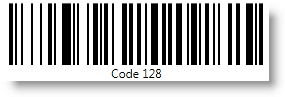

////
|metadata|
{
    "name": "xambarcode-adding-barcode-in-code-behind",
    "controlName": ["{BarcodesName}"],
    "tags": [],
    "guid": "c9440732-d400-48ca-b652-e73ded16274f",
    "buildFlags": [],
    "createdOn": "2015-09-23T20:39:17.4464668Z"
}
|metadata|
////

= Adding Barcode In Code-Behind

== Before You Begin

This topic is designed to get you up and running as quickly as possible by describing the basic steps required for adding a {Barcode128Name}™ control to your application.

== What You Will Accomplish

You will add a basic {Barcode128Name} control to your  pick:[xaml="page"]  pick:[android,win-forms="application"].

== Follow these Steps

[start=1]
. Create a {PlatformName} application in {PlatformIDE} or later.
[start=2]
. Add the following  pick:[xaml,win-forms="references"]  pick:[android="jars"]  to your project:

ifdef::wpf,win-universal[]

** {ApiPlatform}v{ProductVersion}.dll
** {ApiPlatform}DataVisualization.v{ProductVersion}.dll
** {ApiPlatform}Controls.Barcodes.v{ProductVersion}.dll
** {ApiPlatform}Encoding.v{ProductVersion}.dll (only for QR Code)

endif::wpf,win-universal[]
 
ifdef::xamarin[]

In shared project:

** {ApiPlatform}dll
** {ApiPlatform}Controls.Barcodes.dll

In Android project:

** {ApiPlatform}Android.dll
** {ApiPlatform}Controls.Barcodes.Android.dll

In iOS project:

** {ApiPlatform}iOS.dll
** {ApiPlatform}Controls.Barcodes.iOS.dll

endif::xamarin[]

ifdef::android[]
** Infragistics.Barcode jar
** Infragistics.DV.Shared.jar
** Infragistics.UI.jar

endif::android[]

ifdef::win-forms[]
** Infragistics4.Win.DataVisualization.Barcode
** Infragistics4.Win.DataVisualization.Shared
** Infragistics4.Win.Portable.Core

endif::win-forms[]

[start=3]
. Add the following namespaces in application.

ifdef::xaml[]
 

*In Visual Basic:*

----
Imports Infragistics.Controls.Barcodes
----

*In C#:*

----
using Infragistics.Controls.Barcodes;
----

endif::xaml[]

ifdef::win-forms[]

*In Visual Basic:*

----
Imports Infragistics.Win.DataVisualization
----

*In C#:*

----
using Infragistics.Win.DataVisualization;
----

endif::win-forms[]

ifdef::android[]

*In Java:*

----
import com.infragistics.controls.Code128BarcodeView;
import com.infragistics.controls.QRCodeBarcodeView;
----

endif::android[]

[start=4]
. Choose a barcode symbology.  pick:[xaml="To the UserControl_Loaded event handler, add an instance of the chosen xamBarcode symbology naming it Barcode."] 

*Note:* Each barcode symbology is a separate control.

*{BarcodesName} Symbology Types:*

* link:xambarcode-configuring-code128.html[Configuring Code 128]
* link:xambarcode-configuring-qr-code.html[Configuring QR Code]

ifdef::wpf[]
* link:xambarcode-xamcode39barcode.html[Code 39]
* link:xambarcode-xameanupcbarcode.html[Ean/Upc]
* link:xambarcode-xaminterleaved2of5barcode.html[Interleaved 2 Of 5]
* link:xambarcode-xamgs1databarbarcode.html[GS1 DataBar]
* link:xambarcode-xamintelligentmailbarcode.html[Intelligent Mail]
* link:xambarcode-xamroyalmailbarcode.html[Royal Mail]
* link:xambarcode-xampdf417barcode.html[PDF 417]
* link:xambarcode-xammaxicodebarcode.html[Maxi Code]
endif::wpf[]

ifdef::xaml,win-forms[]
  
*In Visual Basic:*

----
Dim Barcode As New {Barcode128Name}()
----

*In C#:*

----
var Barcode = new {Barcode128Name}();
----

endif::xaml,win-forms[]

  
ifdef::android[]

*In Java:*

----
{Barcode128Name} Barcode = new {Barcode128Name}();
----

endif::android[]

[start=5]
. Assign a value to the {Barcode128Name} control’s Data property

ifdef::xaml,win-forms[]
 
*In Visual Basic:*

----
Barcode.Data = "Code128"
----

*In C#:*

----
Barcode.Data = "Code128";
----

endif::xaml,win-forms[]

ifdef::android[]

*In Java:*

----
Barcode.setData("Code128");
----

endif::android[]
 
[start=6]
. Add the instance of {Barcode128Name} to the main view.

ifdef::xaml[]

*In Visual Basic:*

----
Me.LayoutRoot.Children.Add(Barcode)
----

*In C#:*

----
this.LayoutRoot.Children.Add(Barcode);
----

endif::xaml[]

ifdef::win-forms[]

*In Visual Basic:*

----
this.Controls.Add(Barcode)
----

*In C#:*

----
this.Controls.Add(Barcode);
----

endif::win-forms[]

ifdef::android[]

*In Java:*

----
sampleContainer.addView(Barcode);
----

endif::android[]

[start=7]
. Save and run your application.

ifdef::xaml[]

endif::xaml[]