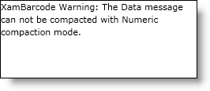

////
|metadata|
{
    "name": "xambarcode-eventhandling",
    "controlName": ["{BarcodesName}"],
    "tags": [],
    "guid": "c71c9ae7-9d07-49bc-a4c8-e4280cac9614",
    "buildFlags": ["XAML"],
    "createdOn": "2015-09-23T20:39:35.3113901Z"
}
|metadata|
////

= Handling Events

== Before You Begin

The {BarcodesName}™ control has two events – link:{BarcodesLink}.{BarcodesRoot}~datachanged_ev.html[DataChanged] and link:{BarcodesLink}.{BarcodesRoot}~errormessagedisplaying_ev.html[ErrorMessageDisplaying]. The ErrorMessageDisplayingEventArgs object’s ErrorMessage property allows you to get or set the error message. The DataChangedEventArgs object’s NewData property conveniently allows you to get the value of the {BarcodesName} control’s Data property that has just been changed.

== What You Will Accomplish

You will handle the DataChanged and ErrorMessageDisplaying events.

== Follow these Steps

[start=1]
. Add a {BarcodesName} control to your page. For more info on this, see  pick:[xaml=" link:xambarcode-adding-xambarcode-using-xaml.html[Adding Barcode Using XAML Code]"]   pick:[xaml="or"]  link:xambarcode-adding-barcode-in-code-behind.html[Adding Barcode In Code-Behind] .
[start=2]
. Handle the events:

ifdef::xaml[]

*In XAML:*

----
<ig:XamMaxiCodeBarcode
        x:Name="Barcode"
        DataChanged="Barcode_DataChanged"
        ErrorMessageDisplaying="Barcode_ErrorMessageDisplaying" />
----

endif::xaml[]

ifdef::xaml[]

*In Visual Basic:*

[source]
----
Import Infragistics.Controls.Barcodes

Private Sub Barcode_DataChanged (ByVal sender As System.Object,
    ByVal e As DataChangedEventArgs)
        Dim errorMessage = e.ErrorMessage
End Sub

Private Sub Barcode_ErrorMessageDisplaying (ByVal sender As System.Object, ByVal e As ErrorMessageDisplayingEventArgs)
    Dim newData = e.NewData
End Sub
---- 

endif::xaml[]

ifdef::xaml[]

*In C#:*

[source]
----
using Infragistics.Controls.Barcodes;

private void Barcode_ErrorMessageDisplaying(object sender,
  ErrorMessageDisplayingEventsArgs e) {
    string errorMessage = e.ErrorMessage;
}

private void Barcode_DataChanged(object, DataChangedEventsArgs e) {
    string newData = e.NewData;
}
----

endif::xaml[]

[start=3]
. Save and run your application.

== Sample Error Message

ifdef::xaml[]

*In XAML:*

----
<ig:XamPdf417Barcode
	x:Name="Barcode"
	Data="xamBarcode"
	EncodingMode="Numeric" />
----

endif::xaml[]

ifdef::xaml[]

*In Visual Basic:*

----
Dim Barcode As New XamPdf417Barcode()
Barcode.Data = "xamBarcode"
Barcode.EncodingMode = CompactionMode.Numeric
----

endif::xaml[]

ifdef::xaml[]

*In C#:*

----
var Barcode = new XamPdf417Barcode();
Barcode.Data = "xamBarcode";
Barcode.EncodingMode = CompactionMode.Numeric;
----

endif::xaml[]

