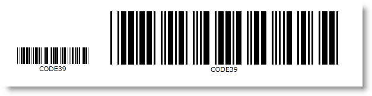

////
|metadata|
{
    "name": "xambarcode-xdimension",
    "controlName": ["{BarcodesName}"],
    "tags": [],
    "guid": "03d7c793-a37c-4935-ab8d-08d4bbbb91f0",
    "buildFlags": [],
    "createdOn": "2015-09-23T20:41:03.8538146Z"
}
|metadata|
////

= Configuring XDimension

For all barcode grid symbologies pick:[xaml=" (excluding the MaxiCode)"], the link:{BarcodesLink}.{BarcodesBase}{ApiProp}xdimension.html[XDimension] property defines the narrow element width for the symbol in millimeters. The property value is used when Stretch.None is used to specify the width of the symbology. The nominal value for every barcode is set as its default value.

pick:[xaml="*Here is a comparison between two barcodes:*"]

ifdef::xaml[]

endif::xaml[]

ifdef::xaml[]

*In XAML:*

----
<ig:{Barcode128Name} x:Name="barcode1" Data="Code Data" Stretch="None" XDimension="0.25" />

<ig:{Barcode128Name} x:Name="barcode2" Data="Code Data" Stretch="None" XDimension="0.8"/>
----

endif::xaml[]

ifdef::xaml,win-forms[]

*In Visual Basic:*

----
Dim barcode1 As New {Barcode128Name}()
barcode1.Data = "Code Data"
barcode1.Stretch = Stretch.None
barcode1.XDimension = 0.25

Dim barcode2 As New {Barcode128Name}()
barcode2.Data = "Code Data"
barcode2.Stretch = Stretch.None
barcode2.XDimension = 0.8
----
 
*In C#:*

----
var barcode1 = new {Barcode128Name}();
barcode1.Data = "Code Data";
barcode1.Stretch = Stretch.None;
barcode1.XDimension = 0.25;

var barcode2 = new {Barcode128Name}();
barcode2.Data = "Code Data";
barcode2.Stretch = Stretch.None;
barcode2.XDimension = 0.8;
----

endif::xaml,win-forms[]

ifdef::android[]

*In Java:*

----
{Barcode128Name} barcode1 = new {Barcode128Name};
barcode1.setData("Code Data");
barcode1.setStretch(Stretch.None);
barcode1.setXDimension("0.25");

{Barcode128Name} barcode2 = new {Barcode128Name};
barcode2.setData("Code Data");
barcode2.setStretch(Stretch.None);
barcode2.setXDimension("0.8");
----

endif::android[]